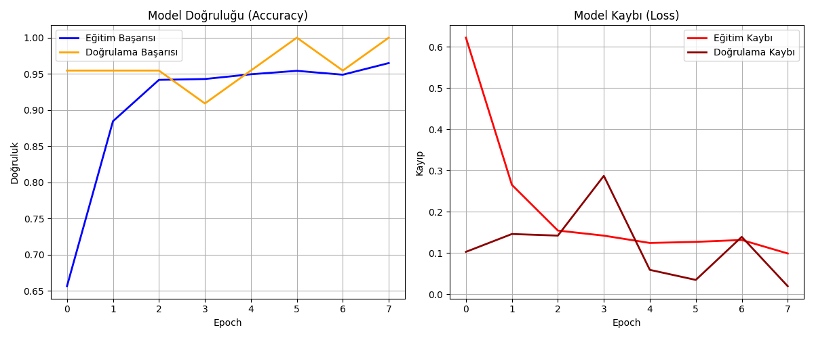

# 🎮 El Hareketleri ile Flappy Bird Kontrolü (Deep Learning)

Bu proje, bir CNN (Convolutional Neural Network) modeli kullanarak el hareketlerini (Yumruk ve Açık El) gerçek zamanlı olarak tanır ve bu hareketlerle bir Flappy Bird oyununu kontrol etmeyi sağlar.

## 📊 Veri Seti Açıklaması
Projede **Kaggle Rock-Paper-Scissors** veri seti kullanılmıştır.
- **Sınıf 1 (Yumruk):** Kuşu zıplatmak ve oyunu yeniden başlatmak için kullanılır.
- **Sınıf 2 (Açık El):** Bekleme durumu (Kuşun yerçekimiyle düşmesi) için kullanılır.
- Veri seti toplam 2000'den fazla resim içermekte olup, eğitim (%80) ve doğrulama (%20) olarak ayrılmıştır.

## 🧠 Model Mimarisi
Model, Keras kullanılarak aşağıdaki katmanlarla oluşturulmuştur:
1. **Conv2D (32 filtre):** Resimdeki temel özellikleri (kenarlar, hatlar) yakalar.
2. **MaxPooling2D:** Boyutu küçülterek en önemli verileri tutar.
3. **Conv2D (64 filtre):** Daha karmaşık el şekillerini öğrenir.
4. **Flatten & Dense:** Öğrenilen verileri sınıflandırmaya hazırlar.
5. **Dropout (%50):** Aşırı öğrenmeyi (overfitting) engeller.
6. **Sigmoid:** Çıkışı 0 (Yumruk) veya 1 (Açık El) olarak belirler.

## 📈 Eğitim Grafikleri ve Metrikler
Eğitim 10 Epoch sürmüştür. Aşağıdaki grafikte modelin eğitim sürecindeki başarı ve kayıp oranları görülmektedir:

- **Final Accuracy:** ~%98
- **Final Loss:** ~0.05

## 🕹️ Nasıl Çalıştırılır?
1. Gerekli kütüphaneleri kurun: `pip install -r requirements.txt`
2. Modeli eğitmek için: `python train_cnn.py`
3. Oyunu oynamak için: `python main.py`
